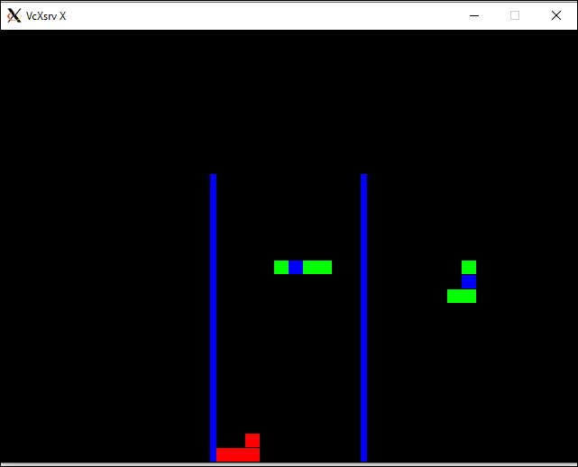

# Tetris clone
### Credits : http://javilop.com/gamedev/tetris-tutorial-in-c-platform-independent-focused-in-game-logic-for-beginners/

### Environment
* env: Windows WSL
* OS : Ubuntu 16.04

### Notes
* Need SDL libraries when building on Ubuntu
* SDL (Simple DirectMedia Layer) is a cross-platform development library designed to provide low level access to audio, keyboard, mouse, joystick, and graphics hardware via OpenGL and Direct3D
  * It basically provides a set of APIs to interact with various devices like graphics hardware, audio, keyboard, mouse, etc

### Installations
```sudo apt-get install libsdl1.2-dev```
```sudo apt-get install libsdl-gfx1.2-dev```
  SDL2 graphics drawing primitives and other support functions

### **Application**


